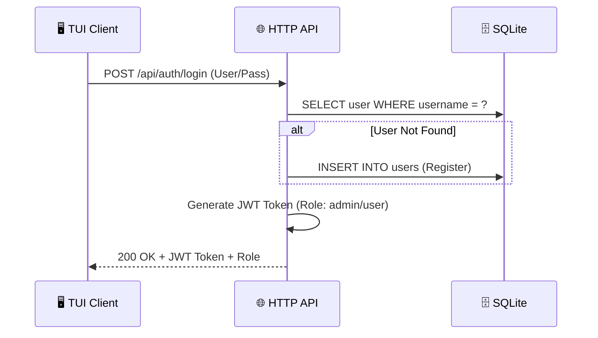
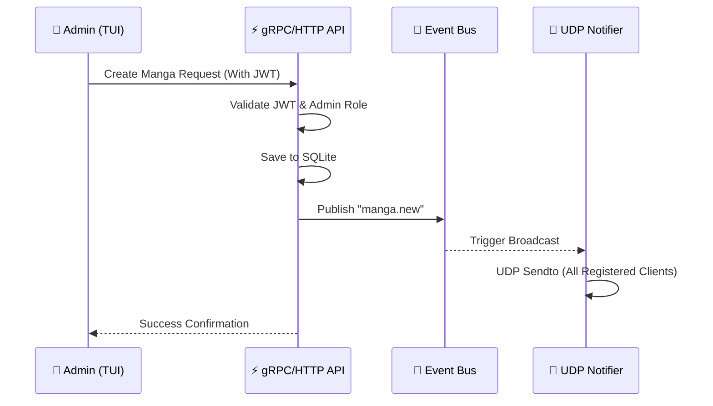
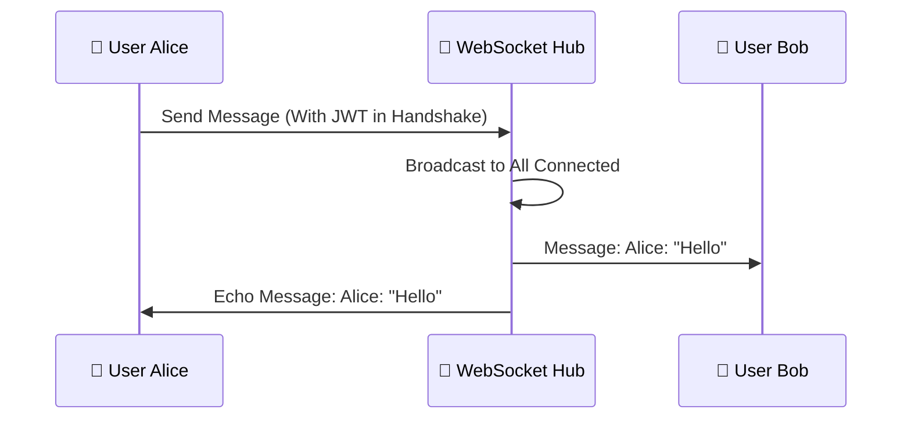
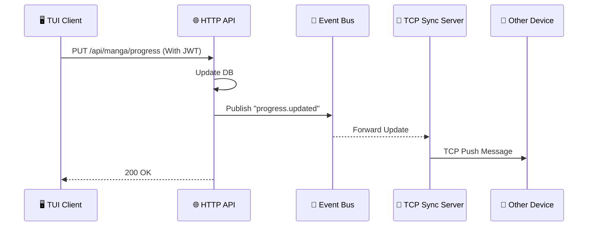

# 📜 MangaHub API Contract & Flows

Tài liệu này định nghĩa tất cả các điểm giao tiếp của hệ thống MangaHub, bao gồm luồng xử lý (Flow), sơ đồ trình tự (Mermaid) và các câu lệnh truy vấn dữ liệu (SQL).

---

## 🔐 1. Authentication Module (HTTP)

### 1.1 Login / Register Auto-flow
- **Endpoint**: `POST /api/auth/login`
- **📍 Source**: `internal/interfaces/http/handlers.go` -> `AuthHandler.Login`
- **🛡️ JWT Required**: **No** (Đây là nơi cấp Token)
- **Logic**: Nếu User chưa tồn tại, hệ thống tự động đăng ký (Register) rồi mới đăng nhập (Login).
- **Flow**:
    1. HTTP Handler nhận Username/Password.
    2. Auth Service kiểm tra trong DB.
    3. Nếu không thấy -> Thực hiện `INSERT` mới.
    4. Nếu thấy -> Kiểm tra Password Hash.
    5. Trả về **JWT Token** chứa `UserID`, `Username`, và `Role`.



- **SQL Query**:
    ```sql
    -- Kiểm tra User
    SELECT id, username, password_hash, role FROM users WHERE username = ?;
    -- Tạo User mới (nếu cần)
    INSERT INTO users (username, password_hash, role) VALUES (?, ?, ?);
    ```

---

## 📚 2. Manga Management (HTTP & gRPC)

### 2.1 Create New Manga
- **Endpoint**: `POST /api/manga` (HTTP) hoặc `AdminService/CreateManga` (gRPC)
- **📍 Source (HTTP)**: `internal/interfaces/http/handlers.go` -> `MangaHandler.CreateManga`
- **📍 Source (gRPC)**: `internal/interfaces/grpc/services.go` -> `AdminService.CreateManga`
- **🛡️ JWT Required**: **Yes** (Phải có Role: `admin`)
- **Flow**:
    1. Handler trích xuất `Role` từ JWT Token.
    2. Manga Service kiểm tra quyền -> Gọi Repository.
    3. Lưu vào DB -> Phát sự kiện `manga.new` vào **Event Bus**.
    4. **UDP Server** bắt sự kiện -> Broadcast đến mọi người dùng.



- **SQL Query**:
    ```sql
    INSERT INTO mangas (title, author, genres, status, total_chapters, description) 
    VALUES (?, ?, ?, ?, ?, ?);
    ```

### 2.2 Search / List Manga (Advanced Filtering)
- **Endpoint**: `GET /api/manga` (HTTP) hoặc `MangaService/SearchManga` (gRPC)
- **📍 Source (HTTP)**: `internal/interfaces/http/handlers.go` -> `MangaHandler.List`
- **📍 Source (gRPC)**: `internal/interfaces/grpc/services.go` -> `MangaService.SearchManga`
- **🛡️ JWT Required**: **Yes** (Mọi user đã login đều search được)
- **Query Parameters**:
    - `q` *(string, optional)*: Fuzzy match trên `title` và `author` (case-insensitive `LIKE %q%`).
    - `genres` *(comma-separated, optional)*: Lọc theo nhiều thể loại. Semantics **OR** giữa các genres. Tối đa **10 genres** mỗi request (vượt thì cắt). Mỗi genre dùng dạng **quoted-token** `%"GENRE"%` để tránh trùng substring (ví dụ `Action` không match nhầm `Reaction`).
    - `status` *(string, optional)*: So khớp **chính xác** với cột `status` (ví dụ `ongoing`, `completed`).
    - `sortBy` *(string, optional)*: `title` → sắp xếp `LOWER(title) ASC`; mọi giá trị khác (bao gồm rỗng, `recent`, hoặc giá trị không xác định) → **lenient fallback** `id DESC`.
- **Combination rule**: Các filter kết hợp theo **AND** giữa các loại (`q AND genres AND status`); riêng nhiều `genres` ghép **OR** với nhau.
- **gRPC parity**: `SearchRequest` có các trường tương đương — `query=1`, `genres=2`, `status=3`, `sort_by=4`. Wire-level back-compat: client cũ chỉ gửi `query` vẫn chạy đúng đường cũ (`SearchMangas`), không bị ảnh hưởng.
- **Routing**: HTTP handler và gRPC service đều phát hiện `hasFilters = (len(genres) > 0 || status != "" || (sortBy != "" && sortBy != "recent"))`. Nếu không có filter mới (chỉ `q` hoặc rỗng) → đi qua hàm `SearchMangas`/`ListMangas` cũ → SQL giữ nguyên hành vi pre-WH7, đảm bảo back-compat.

- **Example HTTP Requests**:
    ```
    GET /api/manga?q=naruto
    GET /api/manga?genres=Action,Romance&status=ongoing
    GET /api/manga?q=blue&genres=Sports&sortBy=title
    ```

- **gRPC SearchRequest**:
    ```protobuf
    message SearchRequest {
        string query = 1;
        repeated string genres = 2;
        string status = 3;
        string sort_by = 4;
    }
    ```

- **SQL Query** (dynamic — clauses joined by AND; per-genre clauses joined by OR):
    ```sql
    -- Example: q=blue, genres=[Action, Romance], status=ongoing, sortBy=title
    SELECT id, title, author, genres, status, total_chapters, description, created_at
    FROM mangas
    WHERE (LOWER(title) LIKE LOWER(?) OR LOWER(author) LIKE LOWER(?))
      AND (genres LIKE ? OR genres LIKE ?)   -- args: %"Action"%, %"Romance"%
      AND status = ?
    ORDER BY LOWER(title) ASC;               -- sortBy=title; otherwise: id DESC
    ```

- **Legacy SQL** (khi không có filter mới):
    ```sql
    SELECT * FROM mangas
    WHERE LOWER(title) LIKE LOWER(?) OR LOWER(author) LIKE LOWER(?)
    ORDER BY id DESC;
    ```

### 2.3 Get Manga Detail
- **Endpoint**: `GET /api/manga/{id}`
- **📍 Source**: `internal/interfaces/http/handlers.go` -> `MangaHandler.Get`
- **🛡️ JWT Required**: **Yes**
- **Flow**: Trả về toàn bộ thông tin chi tiết của một bộ truyện (Mô tả, Tác giả, v.v.) để hiển thị trên màn hình **DETAIL** của TUI.

- **SQL Query**:
    ```sql
    SELECT * FROM mangas WHERE id = ?;
    ```

---

## 💬 3. Real-time Interactions (WebSocket)

### 3.1 Chat Module
- **Endpoint**: `WS /ws/chat`
- **📍 Source**: `internal/interfaces/ws/handlers.go` -> `ChatHandler.HandleChat`
- **🛡️ JWT Required**: **Yes** (Cung cấp Token qua URL query hoặc Header)
- **Flow**:
    1. TUI Client thực hiện Handshake với HTTP Server.
    2. Server nâng cấp kết nối lên **WebSocket**.
    3. Server lưu trữ Connection gắn với `UserID` và `Username` (lấy từ Token).
    4. Khi nhận Message -> Server đóng gói kèm `SenderName` (Username) và phát cho tất cả mọi người.



- **SQL Query**:
    ```sql
    INSERT INTO chat_messages (manga_id, user_id, sender_name, content) 
    VALUES (?, ?, ?, ?);
    ```

---

## 🔄 4. Synchronization & Notifications

### 4.1 Progress Sync (TCP)
- **Port**: `9090` (Raw TCP)
- **📍 Source**: `internal/interfaces/tcp/server.go` -> `TCPServer.Start`
- **🛡️ JWT Required**: **Yes** (Xác thực khi thiết lập kết nối TCP lần đầu)
- **Purpose**: Đảm bảo tiến độ đọc truyện luôn được đồng bộ "ngầm" giữa các thiết bị.
- **Flow**: Client duy trì kết nối TCP -> Khi có update từ bất kỳ đâu, Server đẩy payload qua TCP socket.

### 4.2 Notifications (UDP)
- **Port**: `9191` (UDP)
- **📍 Source**: `internal/interfaces/udp/server.go` -> `UDPServer.Start`
- **🛡️ JWT Required**: **No** (Fire-and-forget, công khai cho mọi TUI Client)
- **Purpose**: Thông báo "Nóng" về truyện mới.
- **Flow**: Server dùng cơ chế **Fire-and-Forget**. Khi có truyện mới, Server gửi một gói tin UDP đến tất cả IP đang lắng nghe.

---

## 📊 5. User Progress (HTTP)

### 5.1 Update Reading Progress
- **Endpoint**: `PUT /api/manga/progress`
- **📍 Source**: `internal/interfaces/http/handlers.go` -> `MangaHandler.UpdateProgress`
- **🛡️ JWT Required**: **Yes** (Cập nhật cho chính User đang đăng nhập)
- **Payload**: `{ "manga_id": 44, "current_chapter": 10, "status": "reading" }`



- **SQL Query** (UPSERT — match exactly với `internal/adapters/database/sqlite_progress_repo.go` -> `Save`):
    ```sql
    INSERT INTO user_progress (user_id, manga_id, current_chapter, status, updated_at)
    VALUES (?, ?, ?, ?, CURRENT_TIMESTAMP)
    ON CONFLICT(user_id, manga_id) DO UPDATE SET
      current_chapter = excluded.current_chapter,
      status = excluded.status,
      updated_at = CURRENT_TIMESTAMP;
    ```

### 5.2 Get Personal Library
- **Endpoint**: `GET /api/manga/library`
- **📍 Source**: `internal/interfaces/http/handlers.go` -> `ProgressHandler.List`
- **🛡️ JWT Required**: **Yes**
- **Flow**: Lấy toàn bộ danh sách truyện mà User đã lưu (Library) cùng với tiến độ đọc tương ứng.

- **SQL Query**:
    ```sql
    SELECT * FROM user_progress WHERE user_id = ? ORDER BY updated_at DESC;
    ```

### 5.3 Reading Statuses (Personal Library)

Personal Library hỗ trợ **3 trạng thái đọc** dưới dạng **convention ở tầng ứng dụng** (không phải SQL CHECK constraint):

- `reading` — đang đọc.
- `completed` — đã hoàn tất.
- `plan_to_read` — dự định đọc.

- **Cách set**: gửi qua payload của `PUT /api/manga/progress` (xem §5.1), trường `"status": "reading" | "completed" | "plan_to_read"`.
- **DB column**: cột `status` trong `user_progress` là kiểu `TEXT` tự do — backend chấp nhận chuỗi nguyên văn, không enforce enum ở tầng SQL. Quy ước 3 trạng thái được TUI và CLI tôn trọng.
- **📍 Source**: `internal/interfaces/http/handlers.go` -> `ProgressHandler.Update` nhận `status` verbatim; `internal/adapters/database/sqlite_progress_repo.go` -> `Save` lưu bằng UPSERT (xem §5.1).

---

## 🕸️ 6. Web Scraping (Internal Service)

### 6.1 Quote-of-the-day Scraper
- **Service**: `internal/application/scraper_service.go` -> `ScraperService.FetchQuotes`
- **Source URL**: `https://quotes.toscrape.com`
- **Surface**: **Internal service** — KHÔNG phải HTTP endpoint. TUI dashboard (`internal/interfaces/tui/app.go`) gọi trực tiếp `NewScraperService().FetchQuotes()` khi render quote-of-the-day trên màn hình home.
- **🛡️ JWT Required**: **N/A** (không có network surface bên ngoài; chạy server-side cho TUI).
- **Implementation note**: Dùng Go stdlib (`net/http` + `regexp`), không phụ thuộc thư viện scraping bên thứ ba. Parse các block `<div class="quote">` để trích `text`, `author`, `tags`.

- **Flow**:
    1. TUI dashboard load → spawn fetch quote qua `tea.Cmd` (non-blocking).
    2. `ScraperService.FetchQuotes()` thực hiện `GET quotes.toscrape.com` → parse HTML bằng regex.
    3. Trả về `[]models.Quote{Text, Author, Tags}` → TUI hiển thị 1 quote ngẫu nhiên trên dashboard.

---

## 💡 Summary Table & Code Map

| Feature | Protocol | Auth (JWT) | Role Required | SQL Action | 📍 Source File |
| :--- | :--- | :--- | :--- | :--- | :--- |
| **Login** | HTTP | **No** | None | SELECT/INSERT user | `http/handlers.go` |
| **Search** | HTTP / gRPC | **Yes** | Any | SELECT LIKE | `http/handlers.go` |
| **Get Detail**| HTTP | **Yes** | Any | SELECT WHERE ID | `http/handlers.go` |
| **Create** | HTTP / gRPC | **Yes** | **Admin** | INSERT manga | `grpc/services.go` |
| **Chat** | WebSocket | **Yes** | Any | INSERT chat_msg | `ws/handlers.go` |
| **Notify** | UDP | **No** | None | N/A (Broadcast) | `udp/server.go` |
| **Sync** | TCP | **Yes** | Any | N/A (Push) | `tcp/server.go` |
| **Update Progress**| HTTP | **Yes** | Any | UPSERT progress | `http/handlers.go` |
| **List Library**| HTTP | **Yes** | Any | SELECT Library | `http/handlers.go` |
| **Web Scraping**| Internal (TUI-invoked)| **N/A** | None | N/A (External fetch) | `application/scraper_service.go` |
