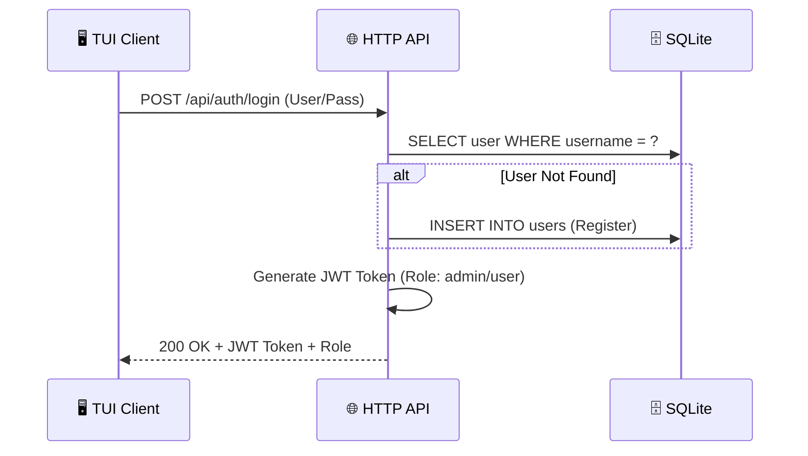
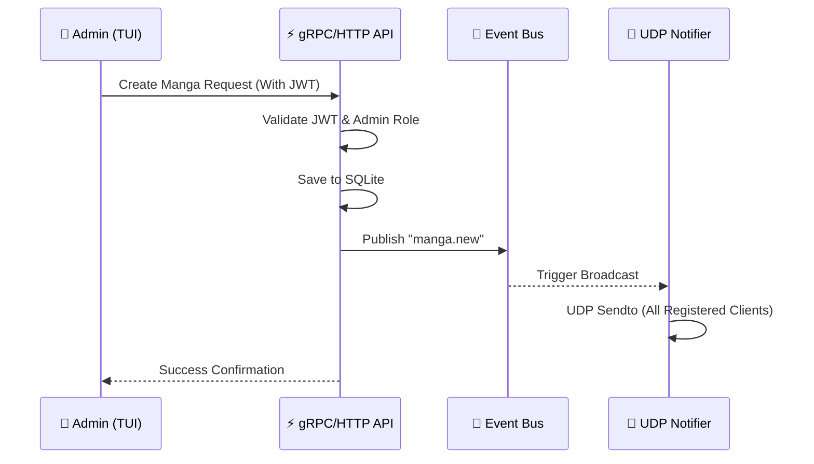
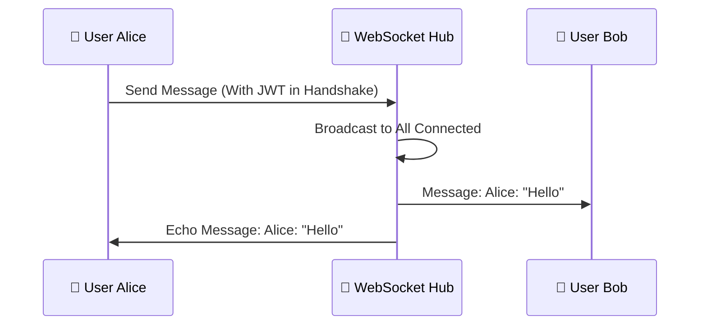
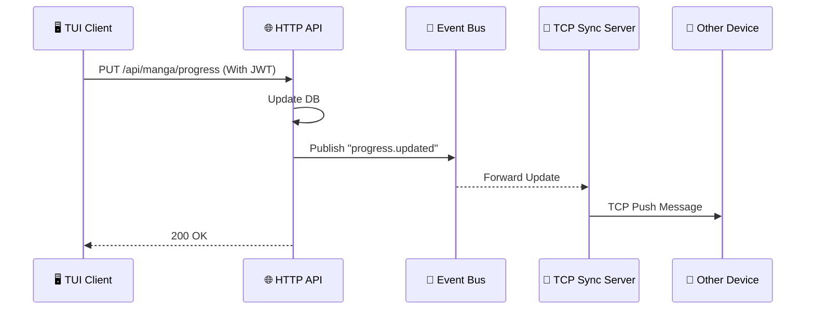

# 📜 MangaHub API Contract & Flows

Tài liệu này định nghĩa tất cả các điểm giao tiếp của hệ thống MangaHub, bao gồm luồng xử lý (Flow), sơ đồ trình tự (Mermaid) và các câu lệnh truy vấn dữ liệu (SQL).

---

## 🔐 1. Authentication Module (HTTP)

### 1.1 Login / Register Auto-flow
- **Endpoint**: `POST /api/auth/login`
- **📍 Source**: `internal/interfaces/http/handlers.go` -> `AuthHandler.Login`
- **🛡️ JWT Required**: **No** (Đây là nơi cấp Token)
- **Logic**: Nếu User chưa tồn tại, hệ thống tự động đăng ký (Register) rồi mới đăng nhập (Login).
- **Flow**:
    1. HTTP Handler nhận Username/Password.
    2. Auth Service kiểm tra trong DB.
    3. Nếu không thấy -> Thực hiện `INSERT` mới.
    4. Nếu thấy -> Kiểm tra Password Hash.
    5. Trả về **JWT Token** chứa `UserID`, `Username`, và `Role`.



- **SQL Query**:
    ```sql
    -- Kiểm tra User
    SELECT id, username, password_hash, role FROM users WHERE username = ?;
    -- Tạo User mới (nếu cần)
    INSERT INTO users (username, password_hash, role) VALUES (?, ?, ?);
    ```

---

## 📚 2. Manga Management (HTTP & gRPC)

### 2.1 Create New Manga
- **Endpoint**: `POST /api/manga` (HTTP) hoặc `AdminService/CreateManga` (gRPC)
- **📍 Source (HTTP)**: `internal/interfaces/http/handlers.go` -> `MangaHandler.CreateManga`
- **📍 Source (gRPC)**: `internal/interfaces/grpc/services.go` -> `AdminService.CreateManga`
- **🛡️ JWT Required**: **Yes** (Phải có Role: `admin`)
- **Flow**:
    1. Handler trích xuất `Role` từ JWT Token.
    2. Manga Service kiểm tra quyền -> Gọi Repository.
    3. Lưu vào DB -> Phát sự kiện `manga.new` vào **Event Bus**.
    4. **UDP Server** bắt sự kiện -> Broadcast đến mọi người dùng.



- **SQL Query**:
    ```sql
    INSERT INTO mangas (title, author, genres, status, total_chapters, description) 
    VALUES (?, ?, ?, ?, ?, ?);
    ```

### 2.2 Search / List Manga
- **Endpoint**: `GET /api/manga?q={query}` (HTTP) hoặc `MangaService/SearchManga` (gRPC)
- **🛡️ JWT Required**: **Yes** (Mọi user đã login đều search được)
- **Flow**: Query string `q` được chuẩn hóa thành lowercase để tìm kiếm mờ (fuzzy search).

- **SQL Query**:
    ```sql
    SELECT * FROM mangas 
    WHERE LOWER(title) LIKE LOWER(?) OR LOWER(author) LIKE LOWER(?) 
    ORDER BY id DESC;
    ```

---

## 💬 3. Real-time Interactions (WebSocket)

### 3.1 Chat Module
- **Endpoint**: `WS /ws/chat`
- **📍 Source**: `internal/interfaces/ws/handlers.go` -> `ChatHandler.HandleChat`
- **🛡️ JWT Required**: **Yes** (Cung cấp Token qua URL query hoặc Header)
- **Flow**:
    1. TUI Client thực hiện Handshake với HTTP Server.
    2. Server nâng cấp kết nối lên **WebSocket**.
    3. Server lưu trữ Connection gắn với `UserID` và `Username` (lấy từ Token).
    4. Khi nhận Message -> Server đóng gói kèm `SenderName` (Username) và phát cho tất cả mọi người.



- **SQL Query**:
    ```sql
    INSERT INTO chat_messages (manga_id, user_id, sender_name, content) 
    VALUES (?, ?, ?, ?);
    ```

---

## 🔄 4. Synchronization & Notifications

### 4.1 Progress Sync (TCP)
- **Port**: `9090` (Raw TCP)
- **📍 Source**: `internal/interfaces/tcp/server.go` -> `TCPServer.Start`
- **🛡️ JWT Required**: **Yes** (Xác thực khi thiết lập kết nối TCP lần đầu)
- **Purpose**: Đảm bảo tiến độ đọc truyện luôn được đồng bộ "ngầm" giữa các thiết bị.
- **Flow**: Client duy trì kết nối TCP -> Khi có update từ bất kỳ đâu, Server đẩy payload qua TCP socket.

### 4.2 Notifications (UDP)
- **Port**: `9191` (UDP)
- **📍 Source**: `internal/interfaces/udp/server.go` -> `UDPServer.Start`
- **🛡️ JWT Required**: **No** (Fire-and-forget, công khai cho mọi TUI Client)
- **Purpose**: Thông báo "Nóng" về truyện mới.
- **Flow**: Server dùng cơ chế **Fire-and-Forget**. Khi có truyện mới, Server gửi một gói tin UDP đến tất cả IP đang lắng nghe.

---

## 📊 5. User Progress (HTTP)

### 5.1 Update Reading Progress
- **Endpoint**: `PUT /api/manga/progress`
- **📍 Source**: `internal/interfaces/http/handlers.go` -> `MangaHandler.UpdateProgress`
- **🛡️ JWT Required**: **Yes** (Cập nhật cho chính User đang đăng nhập)
- **Payload**: `{ "manga_id": 44, "current_chapter": 10, "status": "reading" }`



- **SQL Query**:
    ```sql
    INSERT INTO user_progress (user_id, manga_id, current_chapter, status) 
    VALUES (?, ?, ?, ?)
    ON CONFLICT(user_id, manga_id) DO UPDATE SET 
    current_chapter = excluded.current_chapter, 
    status = excluded.status, 
    updated_at = CURRENT_TIMESTAMP;
    ```

---

## 💡 Summary Table & Code Map

| Feature | Protocol | Auth (JWT) | Role Required | SQL Action | 📍 Source File |
| :--- | :--- | :--- | :--- | :--- | :--- |
| **Login** | HTTP | **No** | None | SELECT/INSERT user | `http/handlers.go` |
| **Search** | HTTP / gRPC | **Yes** | Any | SELECT LIKE | `http/handlers.go` |
| **Create** | HTTP / gRPC | **Yes** | **Admin** | INSERT manga | `grpc/services.go` |
| **Chat** | WebSocket | **Yes** | Any | INSERT chat_msg | `ws/handlers.go` |
| **Notify** | UDP | **No** | None | N/A (Broadcast) | `udp/server.go` |
| **Sync** | TCP | **Yes** | Any | N/A (Push) | `tcp/server.go` |
| **Progress** | HTTP | **Yes** | Any | UPSERT progress | `http/handlers.go` |
