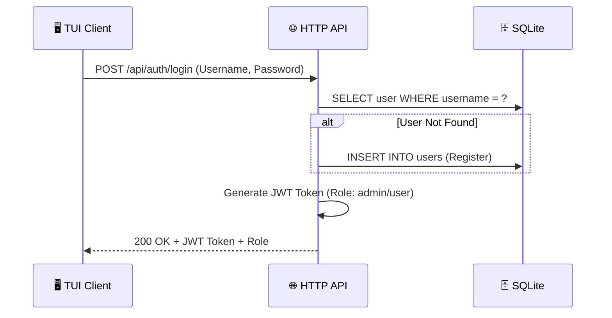
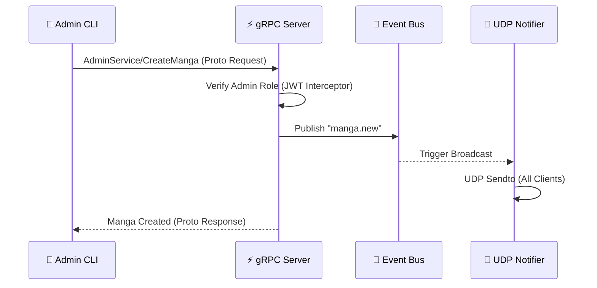
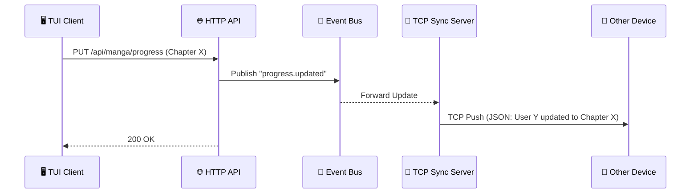
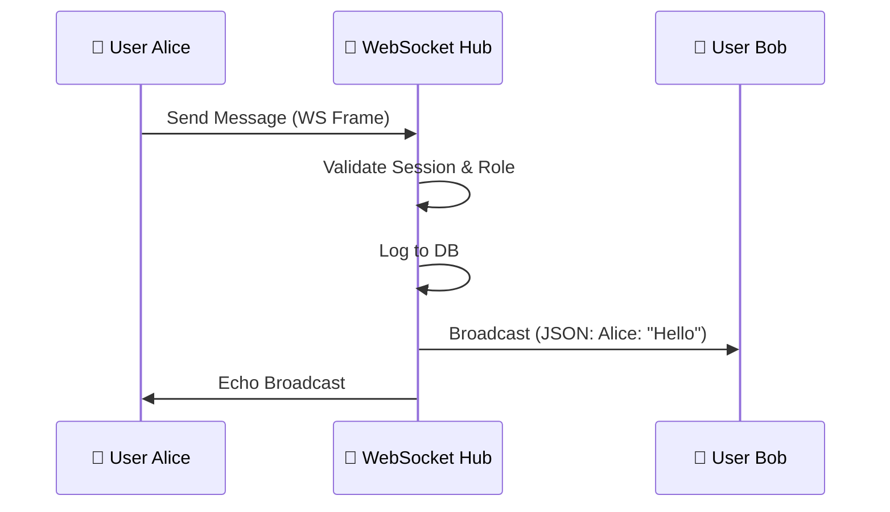

# 📜 MangaHub API Contract & Flows

Tài liệu này định nghĩa tất cả các điểm giao tiếp của hệ thống MangaHub, minh họa bằng các sơ đồ Sequence Diagram để mô tả luồng dữ liệu qua 5 giao thức: **HTTP, gRPC, WebSocket, TCP, UDP**.

---

## 🔐 1. Authentication & Identity (HTTP)

Hệ thống sử dụng cơ chế **Auto-Login/Register** để tối ưu hóa trải nghiệm người dùng trên TUI.

---

## 📚 2. Manga Management (HTTP & gRPC)

### 2.1 Create Manga (gRPC - Admin Only)
Dùng cho các hệ thống quản trị nội bộ hoặc CLI Admin.

### 2.2 Search Manga (HTTP & gRPC)
Hỗ trợ cả Web (HTTP) và App (gRPC).

- **HTTP**: `GET /api/manga?q={query}`
- **gRPC**: `MangaService/SearchManga(SearchRequest)`

---

## 🔄 3. Progress & Sync (HTTP & TCP)

Đây là sự kết hợp giữa **Stateful (TCP)** và **Stateless (HTTP)**.

---

## 💬 4. Real-time Communication (WebSocket)

Hệ thống Chat tập trung (Centralized Hub).

---

## 📊 Summary Protocol Table

| Feature | Protocol | Method/Port | Role Required | Interaction Pattern |
| :--- | :--- | :--- | :--- | :--- |
| **Auth** | HTTP | `POST /login` | Any | Request-Response |
| **Search** | HTTP / gRPC | `GET` / `RPC` | Any | Request-Response |
| **Create** | gRPC / HTTP | `RPC` / `POST` | **Admin** | Request-Response + Broadcast |
| **Sync** | TCP | `Port 9090` | User | Server Push |
| **Notify** | UDP | `Port 9191` | None | Fire-and-Forget |
| **Chat** | WebSocket | `/ws/chat` | User | Full Duplex |

---

## 🛠️ Internal SQL Map

- **Fuzzy Search**: `SELECT * FROM mangas WHERE LOWER(title) LIKE LOWER(?)`
- **Upsert Progress**: `INSERT INTO user_progress (...) ON CONFLICT(...) DO UPDATE`
- **Admin Check**: `SELECT role FROM users WHERE id = ?`
