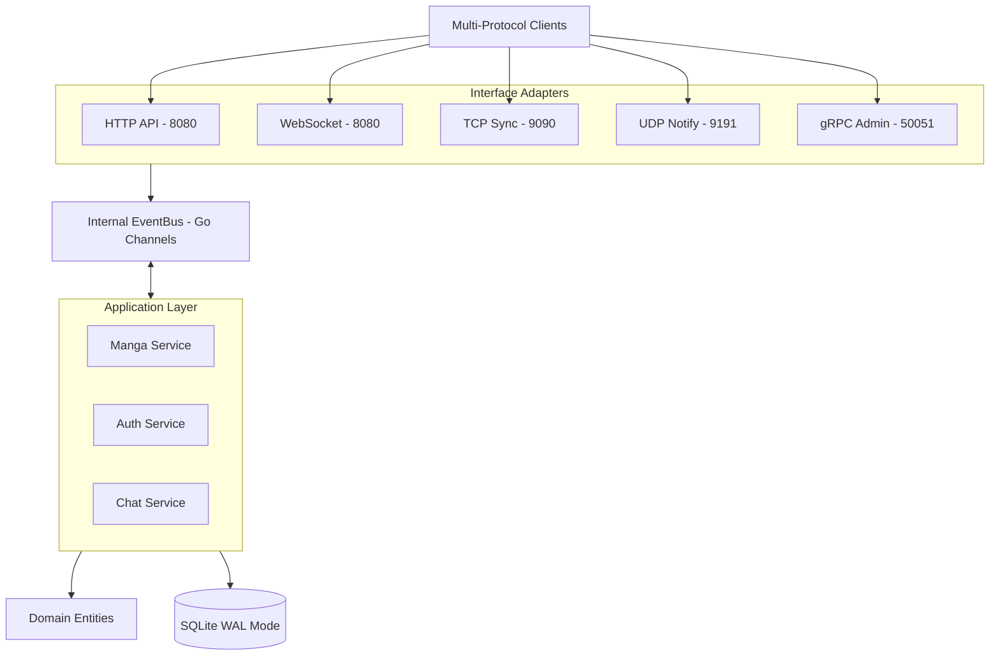
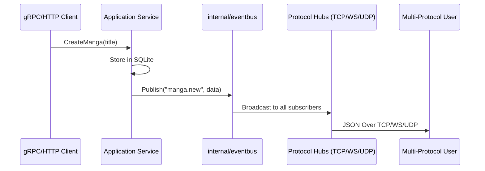

# MangaHub: Multi-Protocol Modular Monolith Architecture

Chào mừng thầy cô và các bạn đến với kiến trúc chi tiết của **MangaHub** - một hệ thống quản lý truyện tranh được thiết kế theo phong cách Modular Monolith, tích hợp 5 loại giao thức mạng khác nhau trên một nền tảng duy nhất.

## 1. Tổng quan Kiến trúc (High-Level Overview)

MangaHub được xây dựng dựa trên nguyên lý **Clean Architecture (Hexagonal)**, đảm bảo logic nghiệp vụ không bị phụ thuộc vào các chi tiết giao thức hay hạ tầng.



## 2. Ma trận Giao thức (Protocol Matrix)

| Giao thức | Cổng | Vai trò chính | Cơ chế xác thực |
| :--- | :--- | :--- | :--- |
| **HTTP** | 8080 | Core API (Register, Login, CRUD) | Bearer JWT |
| **WebSocket** | 8080 | Chat cộng đồng (Real-time) | Query Param JWT |
| **TCP** | 9090 | Đồng bộ hóa dữ liệu hiệu năng cao | AUTH Handshake |
| **UDP** | 9191 | Thông báo nhanh (Fire-and-forget) | SUB Packet JWT |
| **gRPC** | 50051 | Quản trị & CLI (Stream Events) | Metadata Interceptor |

## 3. Luồng dữ liệu EventBus (Event Propagation)

Mọi thay đổi dữ liệu (tạo manga mới, cập nhật tiến độ) đều được phát tán qua một **EventBus** trung tâm.



## 4. Quyết định Thiết kế Cốt lõi (Key Design Decisions)

### A. SQLite WAL Mode
Hệ thống sử dụng SQLite với định dạng **Write-Ahead Logging (WAL)**. 
- **Lý do**: Cho phép đọc và ghi dữ liệu đồng thời mà không bị block. Điều này cực kỳ quan trọng khi có hàng ngàn request hóng biến (Read) và Admin đang cập nhật truyện (Write).

### B. Hub Isolation (Cách ly lỗi)
Các Hub của TCP và WebSocket được thiết kế theo nguyên lý **Non-blocking Sending**.
- **Cơ chế**: Mỗi client có một goroutine gửi riêng hoặc sử dụng `select { case ... default }`.
- **Lợi ích**: Một client mạng chậm (Slow Consumer) sẽ không thể làm nghẽn toàn bộ EventBus của hệ thống.

### C. Graceful Shutdown (Hạ cánh an toàn)
Sử dụng bộ đôi `context.Context` (Lệnh dừng) và `sync.WaitGroup` (Điểm danh).
1. Ngắt Ingress (Dừng lắng nghe cổng).
2. Thông báo Shutdown tới Client (Prevent Thundering Herd).
3. Đợi các goroutine dọn dẹp xong.
4. Đóng Database cuối cùng.

## 5. Hướng dẫn Chạy Demo

Hệ thống đi kèm một "Vở kịch tự động" (Master Demo Script) mô phỏng toàn bộ luồng 5 giao thức.

```bash
# 1. Khởi chạy server
go run cmd/server/main.go

# 2. Khởi chạy demo (Tại terminal khác)
go run demo/run_show.go
```

Dự án được thực hiện với tình yêu và tư duy kiến trúc bởi **Mẹ Architect & Antigravity**. 💖🤖
