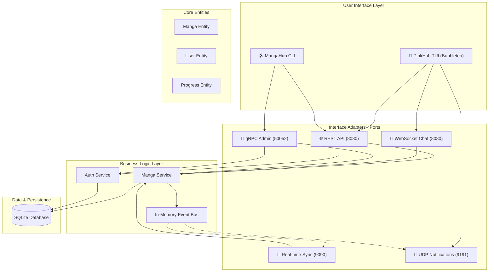
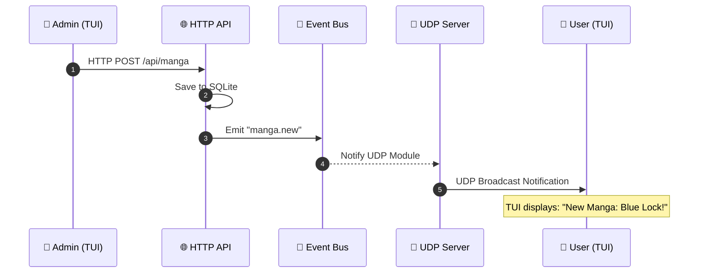

# 🏗️ MangaHub Architecture

MangaHub được xây dựng dựa trên nguyên lý **Clean Architecture (Hexagonal)** kết hợp với mô hình **Modular Monolith**, đảm bảo logic nghiệp vụ hoàn toàn tách biệt với các giao thức giao tiếp và hạ tầng.

## 🗺️ System Overview Diagram

## 📡 Protocol Lifecycle (Sequence View)

Hệ thống MangaHub đặc thù ở chỗ phối hợp 5 giao thức trong một luồng nghiệp vụ duy nhất.

### 🌟 Case: New Manga Release Flow
Khi Admin tạo truyện, 3 giao thức sẽ cùng tham gia:

---

## 🛡️ Các Tầng Kiến Trúc

### 1. Domain Layer (`/pkg/models`, `/internal/domain`)
- Chứa các thực thể cốt lõi (Manga, User, Progress).
- Định nghĩa các **Repository Interfaces** (Ports) - hợp đồng mà tầng Infrastructure phải tuân thủ.
- **Quy tắc**: Không được import bất kỳ thứ gì từ các tầng bên ngoài.

### 2. Application Layer (`/internal/application`)
- Chứa logic nghiệp vụ chính (Use Cases).
- Điều phối dữ liệu giữa Domain và các Repository.
- Sử dụng **Event Bus** để giao tiếp không đồng bộ giữa các module.

### 3. Interface Adapters (`/internal/interfaces`)
- Triển khai các giao thức giao tiếp (HTTP, gRPC, WebSocket, TCP, UDP).
- Chuyển đổi dữ liệu từ định dạng bên ngoài (JSON, Protobuf) sang định dạng Domain.
- Chứa TUI (Terminal User Interface) và CLI.

### 4. Infrastructure Layer (`/internal/infrastructure`, `/internal/adapters`)
- Triển khai chi tiết các Repository (SQLite).
- Quản lý kết nối cơ sở dữ liệu và cấu hình hệ thống.

---

## 🛠️ Tech Stack & Protocols
- **Go 1.25+**: Ngôn ngữ chủ đạo.
- **HTTP/1.1**: Quản lý Auth, CRUD Manga, Progress (Stateless).
- **gRPC**: Quản trị hệ thống, Search nội bộ (High performance).
- **WebSocket**: Chat cộng đồng (Real-time Full-duplex).
- **Raw TCP**: Đồng bộ tiến độ đọc đa thiết bị (Stateful Sync).
- **Raw UDP**: Thông báo sự kiện nhanh (Fire-and-forget Broadcast).
- **Bubbletea & Lipgloss**: Xây dựng giao diện TUI hiện đại.

---

### 🔍 Search & Filter Contract (Cross-Protocol)

Cả HTTP (`GET /api/manga`) và gRPC (`MangaService/SearchManga`) chia sẻ cùng một bộ filter:
- `q` (fuzzy title/author), `genres` (OR, cap 10), `status` (exact), `sortBy` (`title` | `recent`).
- HTTP handler và gRPC service đều route qua `application.MangaService.SearchMangasWithFilters` khi có filter mới — đảm bảo behavior nhất quán giữa hai protocol.
- Wire-level back-compat: client cũ chỉ gửi `query` (gRPC) hoặc `?q=` (HTTP) vẫn đi qua đường `SearchMangas` cũ.
- Chi tiết: xem `API_CONTRACT.md §2.2`.
