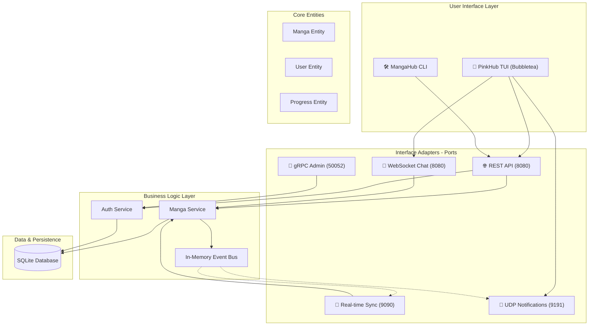

# 🏗️ MangaHub Architecture

MangaHub được xây dựng dựa trên nguyên lý **Clean Architecture (Hexagonal)** kết hợp với mô hình **Modular Monolith**, đảm bảo logic nghiệp vụ hoàn toàn tách biệt với các giao thức giao tiếp và hạ tầng.

## 🗺️ System Overview Diagram

## 🛡️ Các Tầng Kiến Trúc

### 1. Domain Layer (`/pkg/models`, `/internal/domain`)
- Chứa các thực thể cốt lõi (Manga, User, Progress).
- Định nghĩa các **Repository Interfaces** (Ports) - hợp đồng mà tầng Infrastructure phải tuân thủ.
- **Quy tắc**: Không được import bất kỳ thứ gì từ các tầng bên ngoài.

### 2. Application Layer (`/internal/application`)
- Chứa logic nghiệp vụ chính (Use Cases).
- Điều phối dữ liệu giữa Domain và các Repository.
- Sử dụng **Event Bus** để giao tiếp không đồng bộ giữa các module (ví dụ: Tạo Manga xong thì phát tin cho UDP Server).

### 3. Interface Adapters (`/internal/interfaces`)
- Triển khai các giao thức giao tiếp (HTTP, gRPC, WebSocket, TCP, UDP).
- Chuyển đổi dữ liệu từ định dạng bên ngoài (JSON, Protobuf) sang định dạng Domain.
- Chứa TUI (Terminal User Interface) và CLI.

### 4. Infrastructure Layer (`/internal/infrastructure`, `/internal/adapters`)
- Triển khai chi tiết các Repository (SQLite).
- Quản lý kết nối cơ sở dữ liệu và cấu hình hệ thống.

## 📡 Multi-Protocol Flow

Khi một bộ truyện mới được tạo qua TUI:
1. **TUI Client** gửi yêu cầu qua **HTTP POST**.
2. **Manga Service** lưu vào **SQLite** và gửi một sự kiện vào **Event Bus**.
3. **UDP Server** nhận sự kiện từ Bus và broadcast qua **UDP** đến tất cả TUI đang lắng nghe.
4. **WebSocket Server** cho phép các Admin chat với nhau realtime về bộ truyện mới đó.
5. **TCP Server** đảm bảo dữ liệu tiến độ đọc được đồng bộ ngay lập tức giữa các thiết bị.

## 🛠️ Tech Stack
- **Language**: Go 1.25+
- **TUI Framework**: Bubbletea, Lipgloss (Charm Bracelet)
- **Database**: SQLite (WAL Mode enabled)
- **Security**: JWT Authentication (Custom claims)
- **Real-time**: WebSockets & Raw TCP/UDP sockets
