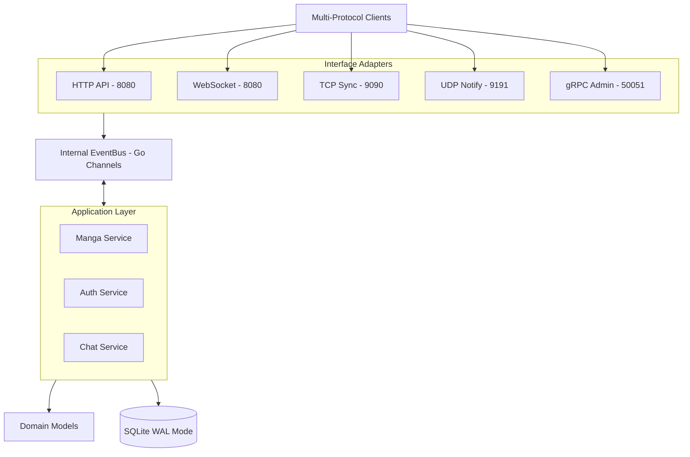
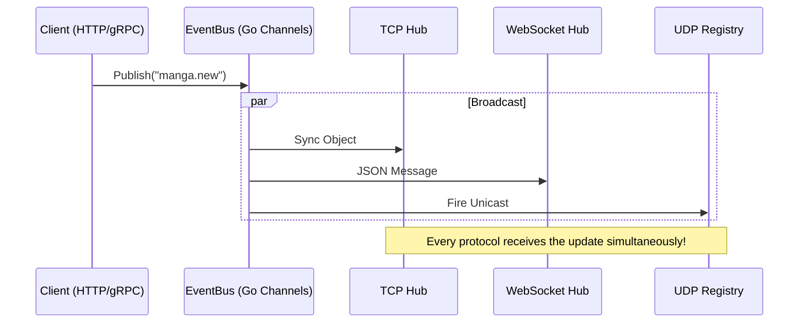

# MangaHub: Multi-Protocol Manga Ecosystem

[](README-eng.md) 
[](README.md)

**MangaHub** is a modern manga management system built as a **Modular Monolith** with a **Hexagonal (Clean Architecture)** approach. This project demonstrates the seamless integration of 5 different network protocols (**HTTP, WebSocket, TCP, UDP, gRPC**) on a single Go platform, delivered as a lightweight "Single Binary".

---

## 🎨 "Pink & Professional" User Experience

The system is designed with a **Pink Pastel (#FBCFE8)** theme on a **Subtle Black (#0B0E11)** background, providing a premium and modern feel:

- **Web Dashboard**: A Shadcn/UI-style interface with 5 pink glow LED indicators for each protocol, pulsating whenever an event is received.
- **TUI (Terminal UI)**: A powerful interactive CLI app featuring dynamic ASCII art (Kero-chan, Berserk, Evangelion) that alternates every 60 seconds.

---

## 🏗️ System Architecture

MangaHub strictly follows the **Modular Monolith** model combined with **Ports & Adapters**, ensuring business logic is decoupled from infrastructure.

### High-Level Diagram


---

## 🚦 Protocol Matrix

| Protocol | Port | Role | Technology |
| :--- | :--- | :--- | :--- |
| **HTTP 1.1** | 8080 | Core API (REST Management) | Native Go `ServeMux` + JWT |
| **WebSocket** | 8080 | Real-time Community Chat | `gorilla/websocket` |
| **TCP** | 9090 | High-performance Binary Sync | Custom Hub + Non-blocking sender |
| **UDP** | 9191 | Lightweight Push Notifications | Fire-and-forget + TTL Registry |
| **gRPC** | 50052 | Admin API & Event Streaming | Protobuf + Server-side Stream |

---

## 🛠️ Development Trace & Technical Decisions

### Phases 1-3: Foundations & Modules
- **Decision**: Use **SQLite in WAL (Write-Ahead Logging) Mode**.
- **Trade-off**: High write-throughput limitation was accepted in exchange for zero-dependency portability (Single Binary) and extreme read performance for real-time protocol monitoring.

### Phases 5-7: Real-time Multi-Protocol Layer
- **Decision (TCP)**: Isolated Hub design. Slow consumers are dropped/skipped to prevent EventBus stalls.
- **Decision (UDP)**: Registration mechanism (SUB Packet) with a 60-second TTL (Time-To-Live).
- **Trade-off**: Sacrificed UDP reliability (no ACKs) for raw speed and minimal system overhead for "ticker-style" notifications.

### Phase 9: Graceful Shutdown (Safe Landing)
- **Decision**: A strict 5-step shutdown procedure (HTTP -> UDP/TCP -> gRPC -> Bus -> DB).
- **Reasoning**: Ensures zero data loss for active chats or reading progress during server maintenance.

---

## 📡 Event Propagation Flow

Every action in the system is synchronized across all protocols via a centralized **EventBus**.



---

## 🚀 Quick Start

Requires Go v1.22+.

### 1. Launch the Server (Terminal 1)
```bash
go run cmd/server/main.go
# The server will start and listen on all 5 ports simultaneously!
```

### 2. Launch the Pink TUI (Terminal 2)
```bash
go run cmd/client/main.go
# Experience the premium "Pink & Professional" terminal interface.
```

### 3. Access Web Dashboard
Open your terminal: [http://localhost:8080](http://localhost:8080)
- **User**: `admin`
- **Pass**: `password`

---

## 🧪 Testing
The system includes a rigorous E2E test suite at `tests/e2e/`. These tests verify high-concurrency stress, fault isolation for slow clients, and cross-protocol data consistency.

```bash
go test -v ./tests/e2e/...
```

---

Crafted with care by **Mẹ Architect & Antigravity**. Enjoy the "Pink Professional" experience! 🌸🤖
