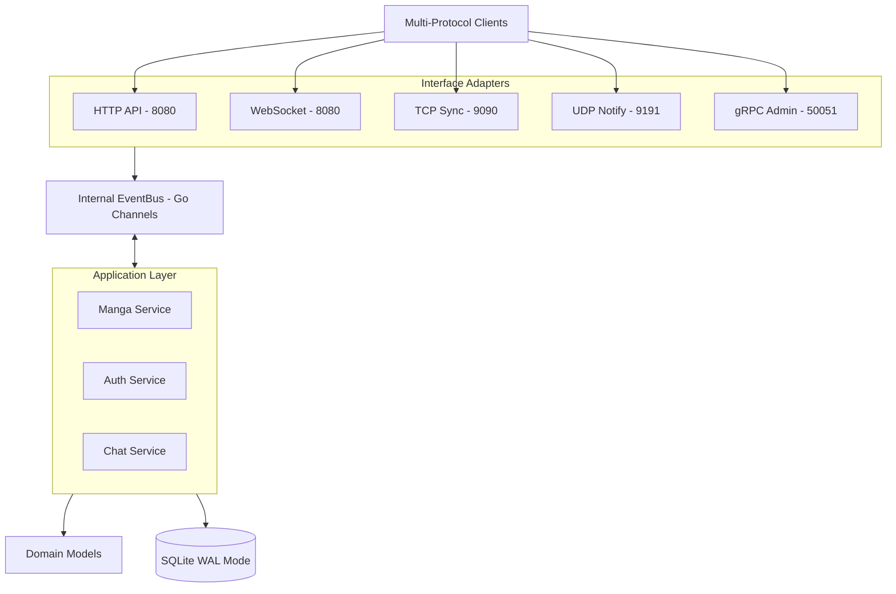
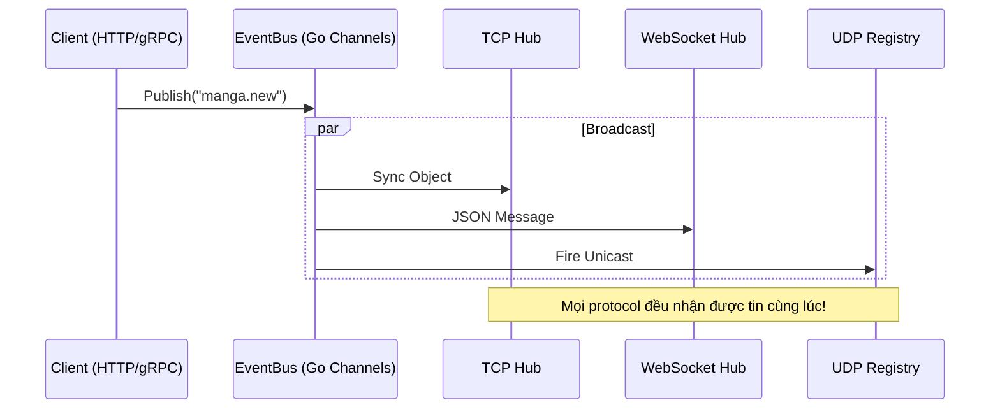

# MangaHub: Hệ sinh thái Truyện tranh Đa giao thức

[](README-eng.md) 
[](README.md)

**MangaHub** là một hệ thống quản lý truyện tranh hiện đại, được xây dựng dưới dạng **Modular Monolith** kết hợp với kiến trúc **Hexagonal (Clean Architecture)**. Dự án thể hiện khả năng tích hợp linh hoạt 5 loại giao thức mạng khác nhau (**HTTP, WebSocket, TCP, UDP, gRPC**) trên một nền tảng Go duy nhất, được đóng gói thành một file binary siêu gọn nhẹ.

---

## 🎨 Trải nghiệm Người dùng "Pink & Professional"

Hệ thống được thiết kế với phong cách **Hồng Phấn (Pink Pastel - #FBCFE8)** trên nền **Đen mờ (Subtle Black - #0B0E11)**, mang lại cảm giác cao cấp và hiện đại:

- **Dashboard Web**: Giao diện mimic phong cách Shadcn/UI, tích hợp 5 đèn LED indicator cho 5 giao thức, nhấp nháy Glow hồng mỗi khi có event.
- **TUI (Terminal UI)**: Ứng dụng dòng lệnh tương tác mạnh mẽ với ASCII art thay đổi linh hoạt (Kero-chan, Berserk, Evangelion) mỗi 60 giây.

---

## 🏗️ Kiến trúc Hệ thống

MangaHub tuân thủ nghiêm ngặt mô hình **Modular Monolith** kết hợp **Ports & Adapters**, giúp tách biệt logic nghiệp vụ khỏi infrastructure.

### Sơ đồ High-Level


---

## 🚦 Ma trận Giao thức (Protocol Matrix)

| Giao thức | Cổng | Vai trò | Công nghệ |
| :--- | :--- | :--- | :--- |
| **HTTP 1.1** | 8080 | Quản lý User, Manga (REST) | Native Go `ServeMux` + JWT |
| **WebSocket** | 8080 | Chat cộng đồng thời gian thực | `gorilla/websocket` |
| **TCP** | 9090 | Đồng bộ hóa dữ liệu Binary | Custom Hub + Non-blocking sender |
| **UDP** | 9191 | Thông báo nhanh (Push Notify) | Fire-and-forget + TTL Registry |
| **gRPC** | 50051 | Admin API & Event Streaming | Protobuf + Server-side Stream |

---

## 🛠️ Trình tự Phát triển & Quyết định Kỹ thuật (Decisions & Trade-offs)

### Giai đoạn 1-3: Nền tảng và Module
- **Quyết định**: Sử dụng **SQLite với chế độ WAL (Write-Ahead Logging)**.
- **Trade-off**: Chấp nhận giới hạn về ghi dữ liệu tập trung để đổi lấy sự tiện lợi (Single Binary) và khả năng đọc dữ liệu đồng thời cực cao cho các giao thức real-time.

### Giai đoạn 5-7: Đa giao thức Real-time
- **Quyết định (TCP)**: Thiết kế Hub cách ly (Isolation). Mỗi client mạng chậm không được phép làm treo EventBus.
- **Quyết định (UDP)**: Cơ chế đăng ký (SUB Packet) với giới hạn thời gian tồn tại (TTL 60s).
- **Trade-off**: UDP không đảm bảo tin nhắn đến nơi, nhưng cực nhẹ cho các ứng dụng theo dõi "ticker" Manga.

### Giai đoạn 9: Graceful Shutdown (Hạ cánh an toàn)
- **Quyết định**: Quy trình đóng server 5 bước nghiêm ngặt (HTTP -> UDP/TCP -> gRPC -> Bus -> DB).
- **Lý do**: Đảm bảo không mất dữ liệu chat/progress của người dùng khi server bảo trì.

---

## 📡 Luồng phát tán Event (Event Propagation)

Mọi hành động trên hệ thống đều được đồng bộ hóa xuyên giao thức thông qua **EventBus**.



---

## 🚀 Hướng dẫn Chạy nhanh

Hệ thống yêu cầu Go v1.22+ trở lên.

### 1. Khởi chạy Server (Terminal 1)
```bash
go run cmd/server/main.go
# Server sẽ khởi động và lắng nghe trên cả 5 cổng cùng lúc!
```

### 2. Khởi chạy Giao diện TUI (Terminal 2)
```bash
go run cmd/client/main.go
# Trải nghiệm giao diện CLI màu hồng phấn xịn sò.
```

### 3. Truy cập Dashboard Web
Mở trình duyệt: [http://localhost:8080](http://localhost:8080)
- **User**: `admin`
- **Pass**: `password`

---

## 🧪 Kiểm thử (Testing)
Hệ thống đi kèm bộ E2E Test cực kỳ khắt khe tại `tests/e2e/`. Luồng test sẽ kiểm tra khả năng chịu tải, cách ly lỗi của các client mạng chậm, và tính nhất quán dữ liệu xuyên giao thức.

```bash
go test -v ./tests/e2e/...
```

---

Dự án được thực hiện bởi **Mẹ Architect & Antigravity**. Chúc mọi người có trải nghiệm "Pink Professional" tuyệt vời nhất! 🌸🤖
